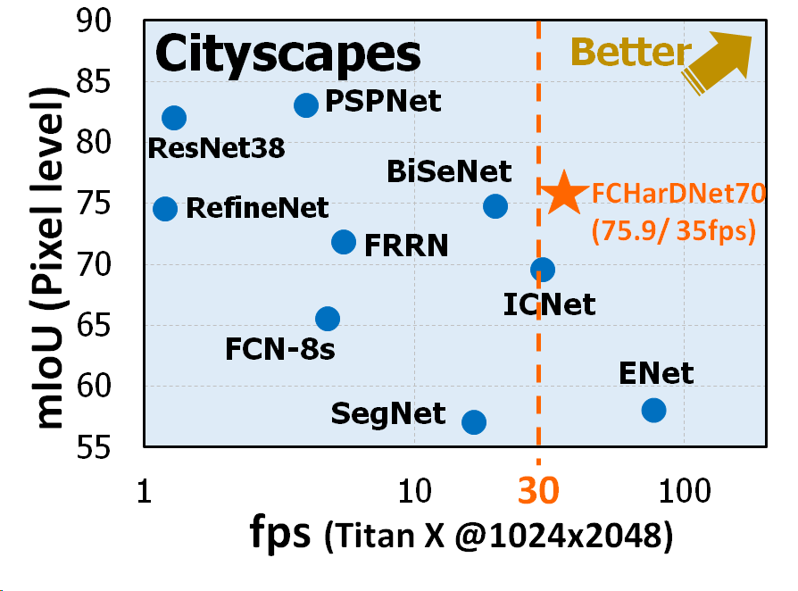
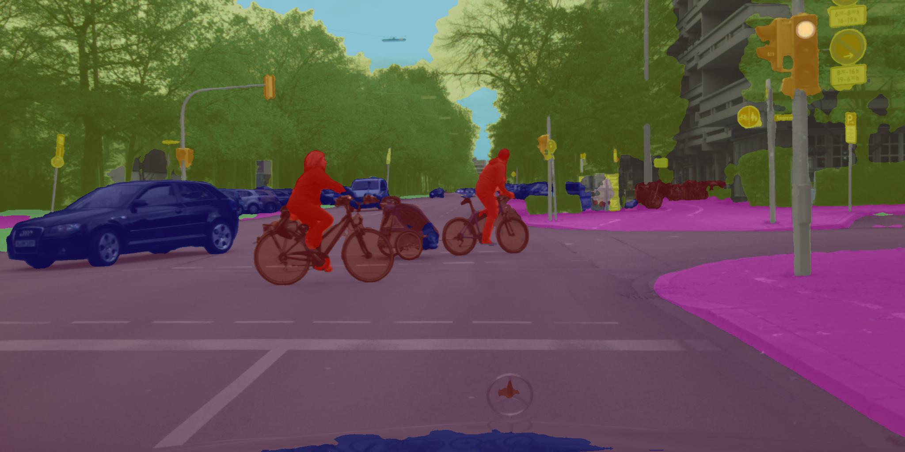
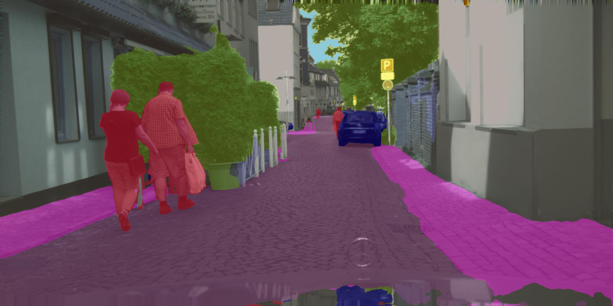

# FCHarDNet
### Fully Convolutional HarDNet for Segmentation in Pytorch
* Implementaion based on [Harmonic DenseNet: A low memory traffic network (ICCV 2019)](https://arxiv.org/abs/1909.00948)
* Refer to [Pytorch-HarDNet](https://github.com/PingoLH/Pytorch-HarDNet) for more information about the backbone model
* This repo was forked from [meetshah1995/pytorch-semseg](https://github.com/meetshah1995/pytorch-semseg)


### Architecture
* Simple U-shaped encoder-decoder structure
* Conv3x3/Conv1x1 only (including the first layer)
* No self-attention layer or Pyramid Pooling  


<p align="center">
  
</p>


### Results  
  
<p align="center">
  
</p>  

| Method | #Param <br>(M) | GMACs /<br> GFLOPs | Cityscapes <br> mIoU  | fps on Titan-V <br>@1024x2048 | fps on 1080ti <br>@1024x2048 |
| :---: |  :---:  |  :---:  | :---:  | :---:  |  :---:  | 
| ICNet  | 7.7  | 30.7  | 69.5 |  63  | 48 | 
| SwiftNetRN-18 | 11.8 | 104 | 75.5 | - | 39.9 | 
| BiSeNet (1024x2048) | 13.4  | 119 | 77.7 | 36 | 27 | 
| BiSeNet (768x1536)  | 13.4  | 66.8 | 74.7 | 72** | 54** | 
| **FC-HarDNet-70**  |  **4.1**  | **35.4** | **76.0** | **70** | **53** |

- ** Speed tested in 1536x768 instead of full resolution.
---------------------

### DataLoaders implemented

* [CamVid](http://mi.eng.cam.ac.uk/research/projects/VideoRec/CamVid/)
* [Pascal VOC](http://host.robots.ox.ac.uk/pascal/VOC/voc2012/segexamples/index.html)
* [ADE20K](http://groups.csail.mit.edu/vision/datasets/ADE20K/)
* [MIT Scene Parsing Benchmark](http://data.csail.mit.edu/places/ADEchallenge/ADEChallengeData2016.zip)
* [Cityscapes](https://www.cityscapes-dataset.com/)
* [NYUDv2](http://cs.nyu.edu/~silberman/datasets/nyu_depth_v2.html)
* [Sun-RGBD](http://rgbd.cs.princeton.edu/)


### Requirements

* pytorch >=0.4.0
* torchvision ==0.2.0
* scipy
* tqdm
* tensorboardX

### Usage

**Setup config file**

Please see the usage section in [meetshah1995/pytorch-semseg](https://github.com/meetshah1995/pytorch-semseg)

**To train the model :**

```
python train.py [-h] [--config [CONFIG]]

--config                Configuration file to use (default: hardnet.yml)
```

**To validate the model :**

```
usage: validate.py [-h] [--config [CONFIG]] [--model_path [MODEL_PATH]] [--save_image]
                       [--eval_flip] [--measure_time]

  --config              Config file to be used
  --model_path          Path to the saved model
  --eval_flip           Enable evaluation with flipped image | False by default
  --measure_time        Enable evaluation with time (fps) measurement | True by default
  --save_image          Enable writing result images to out_rgb (pred label blended images) and out_predID

```

### Pretrained Weights
* Cityscapes pretrained weights: [Download](https://ping-chao.com/hardnet/hardnet70_cityscapes_model.pkl)
<br> (Val mIoU:  77.7,  Test mIoU: 75.9)
* Cityscapes pretrained with color jitter augmentation: [Download](https://ping-chao.com/hardnet/hardnet70_cityscapes_model_2.pkl)
<br> (Val mIoU:  77.4,  Test mIoU: 76.0)
* HarDNet-Petite weights pretrained by ImageNet: 
<br> included in [weights/hardnet_petite_base.pth](https://github.com/PingoLH/FCHarDNet/tree/master/weights)


### Prediction Samples
<p align="center">
  
</p>
<p align="center">
  
</p>
<p align="center">
  
</p>
